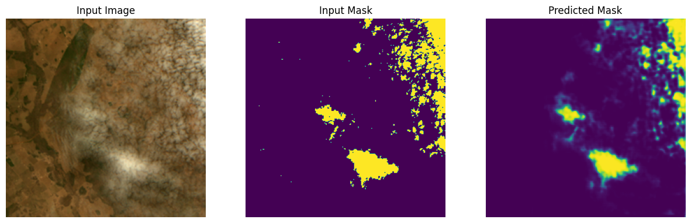
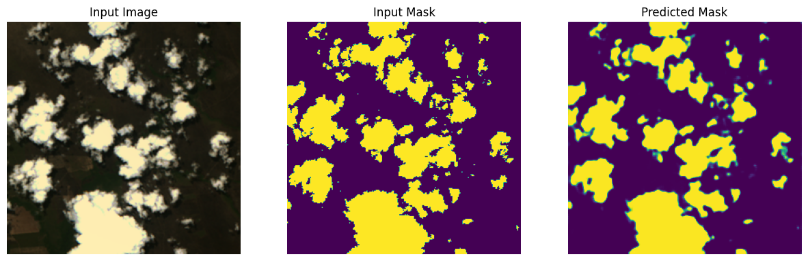
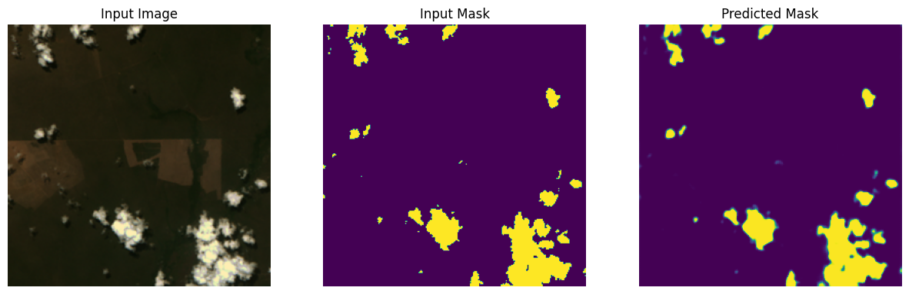

    Problem Statement
    ========================================

    In this work, we propose an open source and automated workflow for
    semantic segmentation of remote sensing images. Even though it can be used
    in other sensors, to evaluate this workflow, a case study has been conducted
    applying a deep learning algorithm for segmenting clouds in images from WFI
    sensor, onboard CBERS-4A satellite. Since WFI does not have a tailor-made
    cloud segmentation algorithm, we customized our workflow based on the U-
    net neural network to fulfill this gap.

    # Visual Results:

